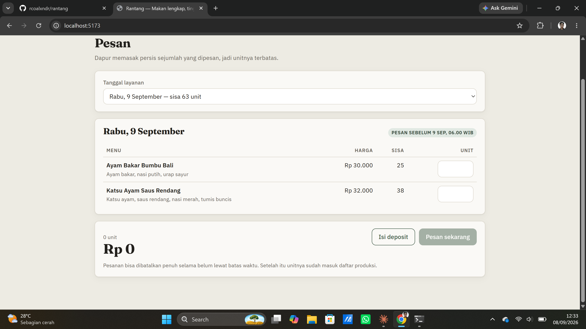
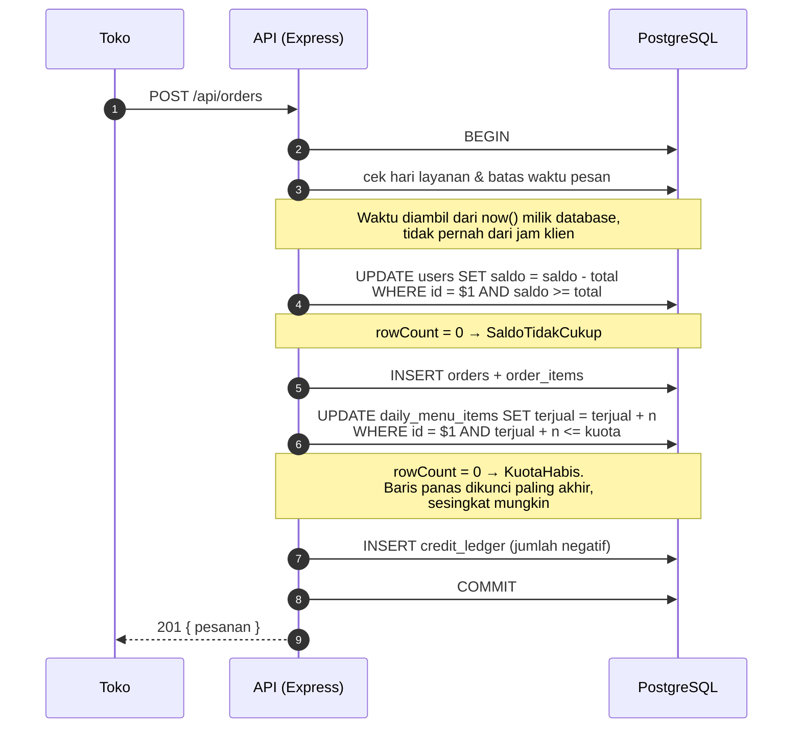

# Rantang — Sistem Pemesanan Prabayar

Sistem pemesanan untuk **Rantang**, konsep bisnis makanan siap-santap bergizi
seimbang dari tugas mata kuliah Kewirausahaan. Bisnisnya belum berjalan;
perangkat lunaknya nyata.

Dibangun sebagai proyek belajar backend: transaksi database, penguncian baris,
dan race condition pada kuota produksi harian.

## Model

Dapur hanya memasak sebanyak yang sudah dipesan. Pelanggan mengisi saldo di
muka, memesan untuk tanggal tertentu sebelum batas waktu, dan dapur membuka
daftar produksi setiap pagi.

## Tangkapan layar



*Sisi toko: menu untuk satu tanggal, sisa unit, dan batas waktu pesan. Dapur
memasak persis sejumlah yang dipesan sebelum batas itu.*

<!-- Belum ada: docs/gambar/dapur-hari.png — layar Hari produksi (daftar
     produksi + daftar kirim). Setelah berkasnya ada, tambahkan barisnya:
      -->

## Alur satu pesanan

Inti sistem ini ada di satu transaksi. Perhatikan dua `UPDATE` bersyarat:
pemeriksaan tidak dilakukan terpisah lalu ditulis, melainkan **menjadi bagian
dari penulisan itu sendiri** — sehingga tidak ada celah waktu yang bisa
disusupi permintaan lain.



Kalau salah satu langkah gagal, seluruh transaksi dibatalkan: deposit utuh,
kuota utuh, tidak ada pesanan setengah jadi.

## Cara membaca repo ini

Kalau kamu cuma punya sepuluh menit, baca tiga berkas ini berurutan:

1. **`server/src/services/order.js`** — inti sistem. Komentar di puncaknya
   menjelaskan aturan urutan penguncian yang dipakai konsisten di seluruh
   berkas untuk mencegah deadlock.
2. **`server/tests/order_service.test.js`** — dua test terakhirnya menembakkan
   20 pemesanan bersamaan untuk satu unit terakhir. Test itu **dibuktikan
   gagal** terhadap implementasi naif sebelum dipakai; catatannya ada di
   riwayat commit.
3. **`server/migrations/`** — skemanya. Aturan yang paling kritis (`saldo >= 0`,
   `terjual <= kuota`) ditegakkan sebagai batasan database, bukan hanya di kode
   aplikasi.

## Teknologi

```
React + Vite → HTTP/JSON → Express (Node) → SQL langsung → PostgreSQL
```

Sengaja tanpa ORM: transaksi, penguncian baris, dan bentuk kueri adalah inti
pelajaran proyek ini, dan ORM menyembunyikan ketiganya.

## Menjalankan secara lokal

Prasyarat: Node 22+, PostgreSQL 16+.

Buat dua database:

```bash
psql -U postgres -c "CREATE DATABASE rantang_dev;"
psql -U postgres -c "CREATE DATABASE rantang_test;"
```

Siapkan konfigurasi dan jalankan migrasi:

```bash
cd server
cp .env.example .env
# sunting .env, isi kata sandi PostgreSQL milikmu
npm install
npm run migrate
npm run seed
```

Lalu siapkan frontend dan jalankan keduanya, masing-masing di terminal sendiri:

```bash
cd web && npm install && npm run dev
```

```bash
cd server && npm run dev
```

Buka `http://localhost:5173`.

Seed membuat tiga akun contoh, semuanya dengan kata sandi `rantang-demo-2026`:

| Email | Peran |
|---|---|
| `dapur@rantang.test` | dapur |
| `melati@toserba.test` | toko |
| `kenanga@toserba.test` | toko |

Hanya untuk database pengembangan di mesin sendiri.

Frontend memakai proxy Vite: permintaan ke `/api` diteruskan ke `localhost:3000`
di belakang layar, sehingga browser melihat keduanya sebagai satu asal. Itulah
yang membuat cookie sesi bekerja tanpa perlu `SameSite=None` maupun CORS saat
pengembangan.

## Test

```bash
cd server
cp .env.example .env.test
# sunting .env.test: isi kata sandi, dan ganti nama database jadi rantang_test
npm run migrate:test
npm test
```

Test dijalankan serial (`--test-concurrency=1`). Ketiga berkas test berbagi
satu database dan saling menimpa kalau berjalan paralel.

## Deploy

Dua layanan, keduanya tingkat gratis tanpa kartu kredit dan tanpa mekanisme
penagihan sama sekali:

- **Neon** — PostgreSQL. Gratis tanpa batas waktu, 0,5 GB.
- **Vercel** — menyajikan frontend statis dan menjalankan Express sebagai
  fungsi. Plan Hobby tidak punya siklus penagihan; melewati batas berarti
  dijeda, bukan ditagih.

Express dijalankan sebagai fungsi, bukan proses yang hidup terus. Itu tidak
menuntut perubahan apa pun di `server/src/` — `buatApp()` memang sudah terpisah
dari `server.js` sejak awal supaya bisa dites tanpa menyalakan server, dan
pemisahan yang sama ternyata cukup untuk berjalan tanpa server.

### 1. Database — Neon

Buat project (AWS, region Singapore), salin connection string-nya.

### 2. Migrasi dari laptop

Tabel harus dibuat sekali. Buat `server/.env.produksi` — namanya diawali `.env`
sehingga otomatis terabaikan git:

```
DATABASE_URL=postgresql://...connection string dari Neon...
```

Lalu:

```bash
cd server && npm run migrate:prod
```

Data contoh, kalau mau demonya berisi:

```bash
cd server && IZINKAN_SEED_PRODUKSI=ya npm run seed:prod
```

Variabel itu wajib karena skrip seed diawali `TRUNCATE` seluruh tabel. Ia
menolak jalan terhadap host mana pun selain `localhost` kecuali diminta
sengaja — yang diperiksa databasenya, bukan `NODE_ENV`, karena skenario paling
berbahaya justru menjalankannya dari laptop ke database daring.

### 3. Vercel

**Add New → Project** → pilih repo `rantang` → Vercel membaca `vercel.json`,
jadi perintah build dan folder keluarannya terisi sendiri.

Tambahkan variabel lingkungan:

```
DATABASE_URL   = (connection string dari Neon)
COOKIE_SECURE  = true
PG_MAX         = 1
```

`PG_MAX=1` karena tiap pemanggilan fungsi berumur pendek; kolam koneksi besar
tidak berguna dan hanya menghabiskan jatah koneksi Neon.

Lalu **Deploy**.

## Struktur

```
server/
  src/db.js          koneksi pool + helper transaksi
  src/auth/          hash kata sandi, sesi, cookie, middleware
  src/services/      logika bisnis (order.js = intinya)
  src/routes/        terjemahan HTTP <-> fungsi
  migrations/        berkas SQL bernomor (004 = saat konsep pindah ke ritel)
  scripts/           pelaksana migrasi + data contoh
  tests/             159 test
web/
  src/api.js         pembungkus fetch + error domain
  src/auth.jsx       konteks sesi (sumber kebenaran: server)
  src/rute.js        routing hash, tanpa pustaka
  src/layar/         enam layar untuk dua peran
docs/
  superpowers/specs/ desain
  superpowers/plans/ rencana implementasi
```

## Dokumen

- Desain: `docs/superpowers/specs/2026-09-07-rantang-pemesanan-design.md`
- Rencana Fase 0–1: `docs/superpowers/plans/2026-09-07-fase-0-1-fondasi.md`
- Catatan Fase 2: `docs/superpowers/plans/2026-09-07-fase-2-auth.md`
- Panduan Fase 4: `docs/superpowers/plans/2026-09-07-fase-4-pemesanan.md`


## Status

**Fase 0–1 — fondasi data.** Skema 8 tabel, migrasi SQL bernomor, dan test yang
membuktikan PostgreSQL menolak saldo minus, over-jual, peran tak dikenal,
status tak dikenal, email ganda, dan penghapusan user yang punya riwayat
pesanan.

**Fase 2 — autentikasi.** Hash kata sandi dengan `crypto.scrypt` bawaan Node
(bergaram, dibandingkan waktu-tetap), sesi acak di database, cookie `httpOnly`,
middleware peran, CORS ditulis sendiri. Endpoint: `register`, `login`,
`logout`, `me`.

**Fase 3 — menu & tanggal layanan.** Dapur mengelola katalog menu, membuka
hari produksi dengan kuota dan batas waktu, serta menutupnya. Toko (dan siapa
pun) bisa melihat menu per tanggal beserta sisa unit. Harga di-snapshot
per tanggal sehingga perubahan harga katalog tidak mengubah tanggal yang sudah
dibuka.

**Fase 4 — inti pemesanan.** Kuota, saldo, transaksi, pembatalan. Pemeriksaan
dan penulisan disatukan dalam satu `UPDATE ... WHERE` sehingga tidak ada celah
antara keduanya; uji perebutan dibuktikan mendeteksi versi naif.

**Fase 5 — deposit toko.** Pengisian deposit lewat transfer manual yang
dikonfirmasi dapur, buku besar sebagai sumber kebenaran, dan endpoint HTTP
untuk seluruh alur toko.

**Fase 6 — dasbor dapur.** Daftar produksi harian (berapa unit tiap menu yang
harus dimasak) dan daftar kirim (toko mana, PIC siapa, ke mana, apa isinya),
plus penandaan pesanan terkirim. Jumlah produksi dihitung ulang dari pesanan yang sebenarnya,
bukan dibaca dari kolom `terjual` — ada test yang menjaga keduanya selalu sama.

**Fase 7 — frontend React.** Enam layar untuk dua peran: pesan, pesanan toko,
deposit dan riwayat mutasi untuk toko; hari produksi (produksi + kirim) dan
kelola (antrean deposit, buka hari, katalog) untuk dapur. Tanpa
pustaka routing maupun pengambil data — React, Vite, dan `fetch` saja.

159 test lulus. Backend dan frontend keduanya berjalan.
